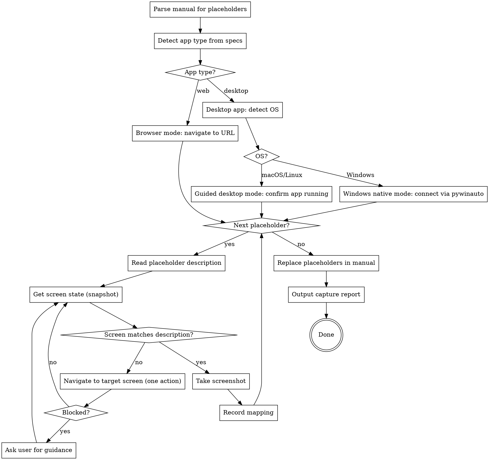

# Auto Capture Screenshots

## Overview

Automatically capture screenshots for every placeholder in a user manual by interactively navigating the running application. Uses a **snapshot-analyze-act** loop — never a blind script — to understand each screen, decide what to click, and verify before capturing.

Supports three capture modes:
- **Browser mode** — web apps via Playwright MCP tools
- **Windows native mode** — WPF/WinForms apps via `pywinauto` (automatic interaction on Windows)
- **Guided desktop mode** — any desktop app where native automation is unavailable (macOS, Linux, or when automation fails)

## When to Use

- User provides a user manual containing `【图X：...】` screenshot placeholders
- User provides specs/source codes so you understand the app's navigation structure
- The target application is running (web app via URL, or desktop app like WPF/WinForms/Electron)
- User asks to "fill in screenshots", "auto capture", "自动截图"

## Prerequisites

1. **User manual** — markdown file with `【图X：...】` placeholders
2. **Specs/source codes** — to understand navigation paths and UI labels
3. **Running application** — web app at a URL, or desktop app (WPF, WinForms, Electron, etc.) open on screen

**REQUIRED SUB-SKILL:** Use `writing-user-manual` — this skill complements the manual generated by that skill.

## App Type Detection

Determine the app type from specs/source codes before starting:

| Signal in specs/source | App Type | Capture Mode |
|------------------------|----------|-------------|
| URLs, routes, HTML, React/Vue/Angular | Web app | Browser mode (Playwright MCP) |
| WPF (`Window`, `UserControl`, XAML, `.csproj` with `PresentationCore`) | Desktop (WPF) | Windows native mode (if on Windows), else Guided desktop |
| WinForms (`Form`, `.csproj` with `System.Windows.Forms`) | Desktop (WinForms) | Windows native mode (if on Windows), else Guided desktop |
| Electron (`electron`, `BrowserWindow`) | Desktop (Electron) | Browser mode (may work with URL) |
| Qt, Swing, Flutter desktop | Desktop (native) | Guided desktop mode |

If unclear, ask the user: "请确认应用类型：1) Web应用（浏览器访问） 2) 桌面应用（如WPF/WinForms）"

### OS Detection for Desktop Mode

After detecting a desktop app, determine the current OS via `Bash`:

```
uname -s    # "Darwin" = macOS, "Linux" = Linux, "MINGW"/"MSYS"/"Windows_NT" = Windows
```

- **Windows** → use Windows native mode (pywinauto)
- **macOS / Linux** → use Guided desktop mode

## Core Principle: Snapshot-Analyze-Act

**NEVER write a monolithic script.** For every interaction:

1. **Snapshot** — take a snapshot of the current UI state (accessibility snapshot for browser, control tree for Windows native, user confirmation for guided)
2. **Analyze** — read the snapshot, understand what's on screen, compare with the placeholder description
3. **Act** — perform ONE action (click, type, navigate) to move closer to the target state
4. **Verify** — snapshot again, confirm the action succeeded
5. **Repeat** until the screen matches the placeholder description, then capture

This ensures every action is informed by the actual screen state, not assumptions.

## Workflow



### Step 1: Parse Placeholders

Extract all `【图X：...】` from the user manual. For each, record:

- Placeholder ID (e.g., `图1`)
- Description text (e.g., `登录页面全貌，展示Logo、输入框、按钮布局`)
- Section context (which chapter/feature it belongs to)

Sort placeholders in the order they appear in the manual — this often follows the natural navigation flow of the app.

### Step 2: Connect to Application

#### Browser Mode (Web Apps)

Search specs/source codes for the application URL. Common locations:
- Config files (dev server port, base URL)
- README or setup docs
- Environment variable defaults

If not found, ask the user: "请提供应用的访问地址（如 http://localhost:3000）。"

Use `browser_navigate` to open the app.

#### Windows Native Mode (WPF/WinForms on Windows)

Connect to the running application using `pywinauto` via `Bash` commands.

**Setup check** — verify `pywinauto` is installed:

```bash
python -c "import pywinauto; print(pywinauto.__version__)"
```

If not installed, run:

```bash
pip install pywinauto
```

**Connect to app** — find the application window and print its control tree:

```python
python -c "
from pywinauto import Desktop
desktop = Desktop(backend='uia')
# List all top-level windows
for w in desktop.windows():
    print(f'{w.window_text()} | class={w.class_name()} | pid={w.process_id()}')
"
```

Identify the target window from the output (match by title or class name). Then connect:

```python
python -c "
from pywinauto import Desktop
desktop = Desktop(backend='uia')
app_window = desktop.window(title='App Title Here')
app_window.set_focus()
print('Connected to:', app_window.window_text())
"
```

**Snapshot control tree** — print the current UI structure:

```python
python -c "
from pywinauto import Desktop
desktop = Desktop(backend='uia')
win = desktop.window(title='App Title Here')
win.print_control_identifiers(depth=3)
"
```

This outputs the control tree with names, types, and identifiers — equivalent to `browser_snapshot` for web apps.

#### Guided Desktop Mode (macOS/Linux)

For desktop apps on non-Windows systems, or when native automation is unavailable:

1. Ask the user to confirm the app is running and visible on screen
2. Guide the user with step-by-step instructions (which buttons/menus to click)
3. Use system screenshot commands for capture
4. Ask the user: "应用是否已打开？我将引导您逐步导航并截取屏幕截图。"

### Step 3: Capture Loop

For each placeholder, execute the capture loop:

#### 3a. Analyze Description

From the placeholder description, determine:
- Which page/screen is needed
- What state the page should be in (logged in? form filled? data loaded?)
- What UI elements should be visible

Use the specs/source codes to map the description to a navigation path (which menus to click, which pages to visit).

#### 3b. Navigate to Target Screen

##### Browser Mode

Using the **snapshot-analyze-act** loop:

1. Take accessibility snapshot: `browser_snapshot`
2. Compare current screen state with target state
3. If not on target screen: identify the next action (click a menu, navigate to a URL, fill a form)
4. Perform ONE action
5. Go back to step 1

**Navigation shortcuts:**
- If you know the exact URL from specs, use `browser_navigate` directly
- If you need to click through menus, use `browser_snapshot` + `browser_click`
- If you need to fill forms first (e.g., login), use `browser_type`

##### Windows Native Mode

Using the **snapshot-analyze-act** loop via `Bash`:

1. **Snapshot** — print the control tree to understand current state:

```python
python -c "
from pywinauto import Desktop
desktop = Desktop(backend='uia')
win = desktop.window(title='App Title Here')
win.print_control_identifiers(depth=3)
"
```

2. **Analyze** — read the control tree output, identify what's visible (buttons, menus, text fields, tabs, tree items)
3. **Act** — perform ONE action using `Bash`:

**Click a button/menu item:**

```python
python -c "
from pywinauto import Desktop
desktop = Desktop(backend='uia')
win = desktop.window(title='App Title Here')
# Click by exact text or best_match
win.child_window(title='课程管理', control_type='MenuItem').click()
"
```

**Type into a text field:**

```python
python -c "
from pywinauto import Desktop
desktop = Desktop(backend='uia')
win = desktop.window(title='App Title Here')
field = win.child_window(control_type='Edit', found_index=0)
field.set_text('input text here')
"
```

**Select a tree item / list item:**

```python
python -c "
from pywinauto import Desktop
desktop = Desktop(backend='uia')
win = desktop.window(title='App Title Here')
win.child_window(title='目标项名称', control_type='TreeItem').select()
"
```

**Click a tab:**

```python
python -c "
from pywinauto import Desktop
desktop = Desktop(backend='uia')
win = desktop.window(title='App Title Here')
win.child_window(title='设置', control_type='TabItem').select()
"
```

**Send keyboard shortcuts:**

```python
python -c "
from pywinauto import Desktop
desktop = Desktop(backend='uia')
win = desktop.window(title='App Title Here')
win.type_keys('%F')  # Alt+F
win.type_keys('^s')  # Ctrl+S
win.type_keys('{ENTER}')
"
```

4. **Verify** — snapshot the control tree again to confirm the action succeeded
5. **Repeat** until the target screen state is reached

**Key rules:**
- Each `Bash` call runs a fresh Python process — do NOT rely on variables between calls
- Always re-discover the window handle (`desktop.window(...)`) in each call
- Use `control_type` to narrow matches: `Button`, `MenuItem`, `Edit`, `TabItem`, `TreeItem`, `ListItem`, `Text`, `DataGrid`
- Use `found_index=0` when multiple controls match and you need the first one
- Use `best_match` as a fallback: `win.child_window(best_match='OK')`

##### Guided Desktop Mode

For desktop apps without native automation:

1. From the specs/source codes, determine the navigation path to the target screen
2. Tell the user exactly what to click:

> 请在应用中执行以下操作：
> 1. 点击左侧菜单 **"课程管理"**
> 2. 点击 **"新建课程"** 按钮
>
> 完成后请回复"ok"，我将截取当前屏幕。

3. Wait for user confirmation
4. Proceed to screenshot capture

**Alternative: keyboard-driven navigation.** If the app supports keyboard shortcuts (found in specs), guide the user with keystrokes:

> 请按以下快捷键导航：
> 1. 按 **Alt+F** 打开文件菜单
> 2. 按 **N** 选择新建
>
> 完成后回复"ok"。

#### 3c. Handle Blocks

If you cannot find a widget, the page looks unexpected, or you're stuck:

1. Take a screenshot to show the user the current state
2. Ask via AskUserQuestion:
   - Describe what you see on screen
   - Describe what you expected to find
   - Ask: "当前页面与预期不符。请选择：1) 手动导航到目标页面后通知我继续截图 2) 提供导航指引 3) 跳过此截图"
3. If user navigates manually → wait, then snapshot and continue
4. If user provides guidance → follow it
5. If user says skip → mark as skipped, move to next

**Windows native mode fallback:** If `pywinauto` cannot find a control or the action fails:
- Print the current control tree and analyze what's available
- If the control tree shows unexpected structure, adjust the selector
- After 3 failed attempts, fall back to guided mode for this placeholder
- Ask user: "自动操作遇到困难。请手动导航到目标页面后通知我，或提供操作指引。"

#### 3d. Capture Screenshot

When the screen matches the description:

**Browser mode:**
1. Use `browser_take_screenshot` to capture
2. Save to `screenshots/` directory

**Windows native mode:**
1. Use `Bash` to capture the window via `pywinauto`:

```python
python -c "
from pywinauto import Desktop
import os
os.makedirs('screenshots', exist_ok=True)
desktop = Desktop(backend='uia')
win = desktop.window(title='App Title Here')
win.capture_as_image().save('screenshots/图1-登录页面.png')
print('Screenshot saved.')
"
```

**Guided desktop mode:**
1. Ask the user to take a screenshot, or use a system screenshot command:
   - macOS: `screencapture -w screenshots/图1-登录页面.png` (captures clicked window)
   - macOS: `screencapture screenshots/图1-登录页面.png` (captures full screen)
   - Or ask user to provide the screenshot file path
2. If the user provides a screenshot file, copy it to `screenshots/` with a descriptive name

**All modes:**
3. Save to a file named descriptively: `screenshots/图1-登录页面.png`, `screenshots/图2-首页概览.png`
4. Record the mapping

### Step 4: Replace Placeholders

After all screenshots are captured:

1. Read the original manual
2. Replace each `【图X：...】` with the corresponding screenshot image reference:

```markdown

```

3. Write the updated manual to a **new file** (never overwrite the original)

### Step 5: Output Capture Report

Output a summary table in the terminal (NOT in the output file):

```
## 截图捕获报告

| 占位符 | 状态 | 截图文件 | 备注 |
|--------|------|---------|------|
| 图1 | 成功 | screenshots/图1-登录页面.png | |
| 图3 | 跳过 | — | 用户手动跳过 |
| 图7 | 成功 | screenshots/图7-统计面板.png | 需要手动填入测试数据 |
```

Status types: **成功** (captured), **跳过** (skipped), **需手动** (needs manual intervention)

## Tool Usage Reference

### Browser Mode (Web Apps)

| Action | Tool | Notes |
|--------|------|-------|
| Read current screen | `browser_snapshot` | Always use before acting |
| Navigate to URL | `browser_navigate` | When you know the exact URL |
| Click element | `browser_click` | Use `ref` from snapshot |
| Type into field | `browser_type` | Use `ref` from snapshot |
| Take screenshot | `browser_take_screenshot` | Save to `screenshots/` directory |
| Wait for page load | `browser_wait_for` | After navigation or clicks |

### Windows Native Mode (WPF/WinForms on Windows)

| Action | Bash Command | Notes |
|--------|-------------|-------|
| List windows | `python -c "from pywinauto import Desktop; ..."` | `Desktop(backend='uia').windows()` |
| Snapshot control tree | `win.print_control_identifiers(depth=3)` | Equivalent to `browser_snapshot` |
| Click button/menu | `win.child_window(title='X', control_type='Button').click()` | ONE action per call |
| Type into field | `field.set_text('value')` | Use `control_type='Edit'` |
| Select tree/list item | `win.child_window(title='X', control_type='TreeItem').select()` | For navigation trees |
| Select tab | `win.child_window(title='X', control_type='TabItem').select()` | For tab controls |
| Send keys | `win.type_keys('%F')` | `%`=Alt, `^`=Ctrl, `{ENTER}`, `{TAB}` |
| Take screenshot | `win.capture_as_image().save('path.png')` | Saves window as PNG |
| Verify state | Re-run `print_control_identifiers` | After each action |

**pywinauto key modifiers:** `%` = Alt, `^` = Ctrl, `+` = Shift. Special keys: `{ENTER}`, `{TAB}`, `{ESC}`, `{BACK}`, `{DELETE}`, `{UP}`, `{DOWN}`, `{LEFT}`, `{RIGHT}`.

### Guided Desktop Mode (macOS/Linux)

| Action | Method | Notes |
|--------|--------|-------|
| Navigate to screen | Guide user with exact steps | Tell user which menus/buttons to click |
| Keyboard shortcuts | Guide user with keystrokes | More reliable than mouse clicks |
| Take screenshot | `screencapture` (macOS) or ask user | `screencapture -w` for window, `screencapture` for full screen |
| Verify screen state | Ask user to confirm | "请确认当前页面是否显示XXX？" |
| Handle blocks | Ask user for help | Same as browser mode block handling |

## Smart Navigation

Use specs/source codes to build a mental map of the app before starting:

- **Route structure** (web) / **Window hierarchy** (desktop) — which screens map to which features
- **Menu labels** — exact text labels for navigation clicks
- **Login flow** — credentials needed to access the app
- **Form fields** — required fields and default values for reaching specific states
- **Keyboard shortcuts** (desktop) — `Alt+X` access keys, tab order, shortcut keys
- **Window navigation** (desktop) — which dialogs open from which buttons, tab control structure

If the app requires authentication, handle login first before starting the capture loop.

### Desktop-Specific Tips

- **WPF XAML files** contain exact button names, menu items, and tab headers — read them to get precise UI labels
- **Access keys** are often defined as `_` prefix in XAML (e.g., `_File` means Alt+F)
- **Tab order** is defined by `KeyboardNavigation.TabNavigation` — useful for form-filling guidance
- **Dialog results** — know which buttons close dialogs vs open new windows

### Windows Native Mode Tips

- **Always use `backend='uia'`** — the UIA backend supports WPF and modern WinForms controls
- **Use `print_control_identifiers(depth=3)`** — depth 3 is usually enough; increase to 4-5 for complex nested layouts
- **`child_window()` selectors** — prefer `title` + `control_type` for precise matching. Fallback to `best_match` or `found_index`
- **Dialogs and popups** — after clicking a button that opens a dialog, the dialog is a child of the main window. Use `win.child_window(title='Dialog Title')` or `win.child_window(control_type='Window')` to find it
- **Data grids** — WPF `DataGrid` may expose as `control_type='DataGrid'` or `control_type='Table'`. Iterate rows with `.get_item(row_index)`
- **Stateless approach** — each `Bash` call is a fresh process. Re-discover the window in every call. Do NOT try to share Python objects between calls

## Common Mistakes

| Mistake | Fix |
|---------|-----|
| Writing a monolithic Playwright/pywinauto script | Use interactive snapshot-analyze-act loop |
| Clicking without checking screen state | Always snapshot before acting |
| Assuming element locations | Use `ref` from accessibility snapshot / control tree |
| Ignoring page load timing | Wait after navigation actions |
| Overwriting original manual | Always write to a new file |
| Capturing wrong screen state | Verify with snapshot before taking screenshot |
| Getting stuck in a loop | Set a max retry count per placeholder (5), then ask user |
| Not creating screenshots directory | Create `screenshots/` before starting captures |
| Sharing Python objects between Bash calls | Each call is a fresh process; re-discover window every time |
| Using `backend='win32'` for WPF | Always use `backend='uia'` for WPF/WinForms |
| Wrong `control_type` in pywinauto selector | Print control tree first to see exact types |
| Not handling dialog popups in Windows mode | After action, re-snapshot to detect new dialogs |
