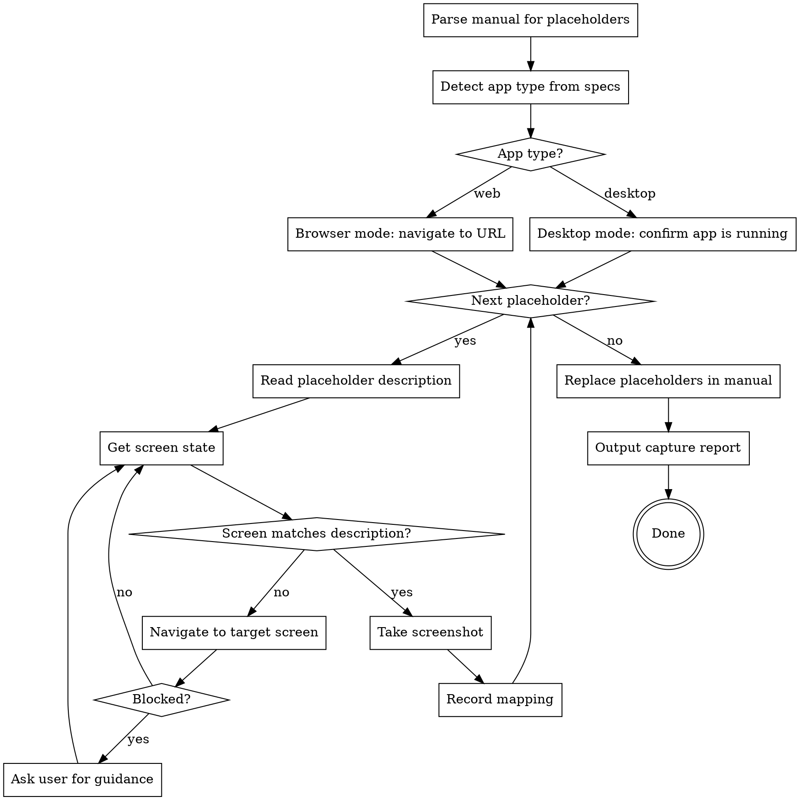

# Auto Capture Screenshots

## Overview

Automatically capture screenshots for every placeholder in a user manual by interactively navigating the running application. Uses a **snapshot-analyze-act** loop — never a blind script — to understand each screen, decide what to click, and verify before capturing.

## When to Use

- User provides a user manual containing `【图X：...】` screenshot placeholders
- User provides specs/source codes so you understand the app's navigation structure
- The target application is running (web app via URL, or desktop app like WPF/WinForms/Electron)
- User asks to "fill in screenshots", "auto capture", "自动截图"

## Prerequisites

1. **User manual** — markdown file with `【图X：...】` placeholders
2. **Specs/source codes** — to understand navigation paths and UI labels
3. **Running application** — web app at a URL, or desktop app (WPF, WinForms, Electron, etc.) open on screen

**REQUIRED SUB-SKILL:** Use `writing-user-manual` — this skill complements the manual generated by that skill.

## App Type Detection

Determine the app type from specs/source codes before starting:

| Signal in specs/source | App Type | Capture Mode |
|------------------------|----------|-------------|
| URLs, routes, HTML, React/Vue/Angular | Web app | Browser mode (Playwright MCP) |
| WPF (`Window`, `UserControl`, XAML, `.csproj` with `PresentationCore`) | Desktop (WPF) | Desktop mode |
| WinForms (`Form`, `.csproj` with `System.Windows.Forms`) | Desktop (WinForms) | Desktop mode |
| Electron (`electron`, `BrowserWindow`) | Desktop (Electron) | Browser mode (may work with URL) |
| Qt, Swing, Flutter desktop | Desktop (native) | Desktop mode |

If unclear, ask the user: "请确认应用类型：1) Web应用（浏览器访问） 2) 桌面应用（如WPF/WinForms）"

## Core Principle: Snapshot-Analyze-Act

**NEVER write a monolithic script.** For every interaction:

1. **Snapshot** — take an accessibility snapshot of the current page
2. **Analyze** — read the snapshot, understand what's on screen, compare with the placeholder description
3. **Act** — perform one action (click, type, navigate) to move closer to the target state
4. **Verify** — snapshot again, confirm the action succeeded
5. **Repeat** until the screen matches the placeholder description, then capture

This ensures every action is informed by the actual screen state, not assumptions.

## Workflow



### Step 1: Parse Placeholders

Extract all `【图X：...】` from the user manual. For each, record:

- Placeholder ID (e.g., `图1`)
- Description text (e.g., `登录页面全貌，展示Logo、输入框、按钮布局`)
- Section context (which chapter/feature it belongs to)

Sort placeholders in the order they appear in the manual — this often follows the natural navigation flow of the app.

### Step 2: Connect to Application

#### Browser Mode (Web Apps)

Search specs/source codes for the application URL. Common locations:
- Config files (dev server port, base URL)
- README or setup docs
- Environment variable defaults

If not found, ask the user: "请提供应用的访问地址（如 http://localhost:3000）。"

Use `browser_navigate` to open the app.

#### Desktop Mode (WPF, WinForms, etc.)

Desktop apps cannot be automated via browser tools. Instead:

1. Ask the user to confirm the app is running and visible on screen
2. Determine how to interact with the app:
   - **Keyboard shortcuts** — use `Bash` to send keystrokes via system tools
   - **User-guided navigation** — tell the user exactly which buttons/menus to click, then wait for confirmation
   - **Screenshot capture** — use system screenshot commands
3. Ask the user: "应用是否已打开？我将引导您逐步导航并截取屏幕截图。"

### Step 3: Capture Loop

For each placeholder, execute the capture loop:

#### 3a. Analyze Description

From the placeholder description, determine:
- Which page/screen is needed
- What state the page should be in (logged in? form filled? data loaded?)
- What UI elements should be visible

Use the specs/source codes to map the description to a navigation path (which menus to click, which pages to visit).

#### 3b. Navigate to Target Screen

##### Browser Mode

Using the **snapshot-analyze-act** loop:

1. Take accessibility snapshot: `browser_snapshot`
2. Compare current screen state with target state
3. If not on target screen: identify the next action (click a menu, navigate to a URL, fill a form)
4. Perform ONE action
5. Go back to step 1

**Navigation shortcuts:**
- If you know the exact URL from specs, use `browser_navigate` directly
- If you need to click through menus, use `browser_snapshot` + `browser_click`
- If you need to fill forms first (e.g., login), use `browser_type`

##### Desktop Mode

For desktop apps (WPF, WinForms, etc.), use **guided navigation**:

1. From the specs/source codes, determine the navigation path to the target screen (which menu items, which buttons, which tabs)
2. Tell the user exactly what to click:

> 请在应用中执行以下操作：
> 1. 点击左侧菜单 **"课程管理"**
> 2. 点击 **"新建课程"** 按钮
>
> 完成后请回复"ok"，我将截取当前屏幕。

3. Wait for user confirmation
4. Proceed to screenshot capture

**Alternative: keyboard-driven navigation.** If the app supports keyboard shortcuts (found in specs), guide the user with keystrokes instead of clicks — this is more reliable:

> 请按以下快捷键导航：
> 1. 按 **Alt+F** 打开文件菜单
> 2. 按 **N** 选择新建
>
> 完成后回复"ok"。

#### 3c. Handle Blocks

If you cannot find a widget, the page looks unexpected, or you're stuck:

1. Take a screenshot to show the user the current state
2. Ask via AskUserQuestion:
   - Describe what you see on screen
   - Describe what you expected to find
   - Ask: "当前页面与预期不符。请选择：1) 手动导航到目标页面后通知我继续截图 2) 提供导航指引 3) 跳过此截图"
3. If user navigates manually → wait, then snapshot and continue
4. If user provides guidance → follow it
5. If user says skip → mark as skipped, move to next

#### 3d. Capture Screenshot

When the screen matches the description:

**Browser mode:**
1. Use `browser_take_screenshot` to capture
2. Save to `screenshots/` directory

**Desktop mode:**
1. Ask the user to take a screenshot, or use a system screenshot command:
   - macOS: `screencapture -w screenshots/图1-登录页面.png` (captures clicked window)
   - macOS: `screencapture screenshots/图1-登录页面.png` (captures full screen)
   - Or ask user to provide the screenshot file path
2. If the user provides a screenshot file, copy it to `screenshots/` with a descriptive name

**Both modes:**
3. Save to a file named descriptively: `screenshots/图1-登录页面.png`, `screenshots/图2-首页概览.png`
4. Record the mapping

### Step 4: Replace Placeholders

After all screenshots are captured:

1. Read the original manual
2. Replace each `【图X：...】` with the corresponding screenshot image reference:

```markdown

```

3. Write the updated manual to a **new file** (never overwrite the original)

### Step 5: Output Capture Report

Output a summary table in the terminal (NOT in the output file):

```
## 截图捕获报告

| 占位符 | 状态 | 截图文件 | 备注 |
|--------|------|---------|------|
| 图1 | 成功 | screenshots/图1-登录页面.png | |
| 图3 | 跳过 | — | 用户手动跳过 |
| 图7 | 成功 | screenshots/图7-统计面板.png | 需要手动填入测试数据 |
```

Status types: **成功** (captured), **跳过** (skipped), **需手动** (needs manual intervention)

## Tool Usage Reference

### Browser Mode (Web Apps)

| Action | Tool | Notes |
|--------|------|-------|
| Read current screen | `browser_snapshot` | Always use before acting |
| Navigate to URL | `browser_navigate` | When you know the exact URL |
| Click element | `browser_click` | Use `ref` from snapshot |
| Type into field | `browser_type` | Use `ref` from snapshot |
| Take screenshot | `browser_take_screenshot` | Save to `screenshots/` directory |
| Wait for page load | `browser_wait_for` | After navigation or clicks |

### Desktop Mode (WPF, WinForms, etc.)

| Action | Method | Notes |
|--------|--------|-------|
| Navigate to screen | Guide user with exact steps | Tell user which menus/buttons to click |
| Keyboard shortcuts | Guide user with keystrokes | More reliable than mouse clicks |
| Take screenshot | `screencapture` (macOS) or ask user | `screencapture -w` for window, `screencapture` for full screen |
| Verify screen state | Ask user to confirm | "请确认当前页面是否显示XXX？" |
| Handle blocks | Ask user for help | Same as browser mode block handling |

## Smart Navigation

Use specs/source codes to build a mental map of the app before starting:

- **Route structure** (web) / **Window hierarchy** (desktop) — which screens map to which features
- **Menu labels** — exact text labels for navigation clicks
- **Login flow** — credentials needed to access the app
- **Form fields** — required fields and default values for reaching specific states
- **Keyboard shortcuts** (desktop) — `Alt+X` access keys, tab order, shortcut keys
- **Window navigation** (desktop) — which dialogs open from which buttons, tab control structure

If the app requires authentication, handle login first before starting the capture loop.

### Desktop-Specific Tips

- **WPF XAML files** contain exact button names, menu items, and tab headers — read them to get precise UI labels
- **Access keys** are often defined as `_` prefix in XAML (e.g., `_File` means Alt+F)
- **Tab order** is defined by `KeyboardNavigation.TabNavigation` — useful for form-filling guidance
- **Dialog results** — know which buttons close dialogs vs open new windows

## Common Mistakes

| Mistake | Fix |
|---------|-----|
| Writing a monolithic Playwright script | Use interactive snapshot-analyze-act loop |
| Clicking without checking screen state | Always snapshot before acting |
| Assuming element locations | Use `ref` from accessibility snapshot |
| Ignoring page load timing | Wait after navigation actions |
| Overwriting original manual | Always write to a new file |
| Capturing wrong screen state | Verify with snapshot before taking screenshot |
| Getting stuck in a loop | Set a max retry count per placeholder (5), then ask user |
| Not creating screenshots directory | Create `screenshots/` before starting captures |
