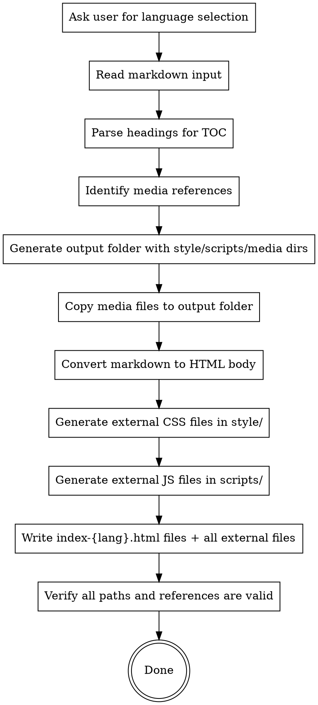
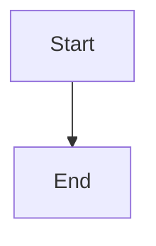

# Generating HTML Manual

## Overview

Convert a Markdown user manual into styled HTML pages with sidebar catalogue navigation, back-to-top button, and company branding. Each language gets its own `index-{lang}.html` file with content hardcoded in that language. Language switching navigates between files — no URL parameters, no runtime content injection. Anchors (like `#system-login`) work cleanly across all languages without `?lang=` conflicts.

## When to Use

- User provides a Markdown user manual (`.md` file) and wants an HTML version
- User asks to "convert manual to HTML", "generate HTML manual", "转HTML", "生成HTML手册"
- Before generating HTML, you MUST ask the user to select languages (Step 0). Default: Simplified Chinese only if the user confirms it.

## Prerequisites

1. **Markdown user manual** — the `.md` file to convert
2. **Media files** — any images or assets referenced in the markdown (relative paths)

**REQUIRED REFERENCES:**
- Read `color-spec.md` in this skill's directory for the complete color system and design tokens.
- Read `company_style/` in this skill's directory for logo assets.

**DEVELOPMENT METHODOLOGY — TDD Required (RED-GREEN-REFACTOR):**

This skill generates styled HTML pages with external CSS/JS files. Each language gets its own `index-{lang}.html` file with all content hardcoded — no runtime injection, no URL parameters. **HTML/CSS/JS code generation (Steps 3-4) MUST follow the superpowers TDD cycle:**

1. **RED — Write failing tests first:** Before writing ANY HTML/CSS/JS code, write test assertions for each structure, style, and behavior. Tests must verify:
   - Correct heading hierarchy and ID slugs (anchor IDs are **always** lowercase English words with hyphen separators, regardless of content language; Chinese/Russian/Japanese/Korean/Arabic titles are translated to English for anchors; NEVER use pinyin or transliteration — e.g., `system-settings-export-path`, not `xi-tong-she-zhi`)
   - TOC link targets resolve to valid heading IDs
   - Sidebar toggle is a **pure icon button** (☰, no visible text) positioned left of the logo in the header
   - Back-to-top button is a **pure icon** (↑ or ▲, no visible text), fixed bottom-right; hidden at top, visible after scroll > 400px
   - Anchor scroll offset prevents fixed header from hiding targets
   - Contrast rules (no dark text on dark backgrounds)
   - Media path correctness (all `src`/`href` point to files that exist in `media/`)
   - All external file references resolve correctly (`style/*.css`, `scripts/*.js` — all relative paths from each `index-{lang}.html`)
   - Output directory contains all required subdirectories (`style/`, `scripts/`, `media/`). NO `i18n/` directory.
   - Print styles hide navigation chrome
   - **Multi-language:** Each language in `LANGS` produces a separate `index-{lang}.html` file (e.g., `index-zh-CN.html`, `index-en-US.html`, `index-ru-RU.html`)
   - **Multi-language:** Each `index-{lang}.html` has ALL content (body + TOC) hardcoded in that language — NO runtime content injection, NO `I18N_CONTENT`, NO `switchLanguage()`
   - `#` (h1) heading is rendered as `<h1>` in body content with the `#` prefix stripped from visible text (e.g., `# 研知AI互动课堂` → `<h1>研知AI互动课堂</h1>`). The version string immediately following the `#` heading goes in header version span, not body.
   - **Multi-language:** Anchor IDs are byte-for-byte identical across ALL `index-{lang}.html` files (not just semantically similar)
   - **Single-language:** Output a single `index.html` with content hardcoded directly
   - Anchor IDs never contain non-English characters (no pinyin, no Cyrillic, no Kanji, no Hangul, no Arabic script)
   - Language switcher is a `<select>` dropdown with `.lang-switch-select` class; each `<option>` shows flag emoji + language name (e.g., `🇨🇳 简体中文`, `🇺🇸 English`)
   - Language switcher `onchange` navigates to the other language file: `window.location.href = 'index-' + lang + '.html'` (preserving current `#anchor`)
   - `index.html` is a redirector that reads `localStorage` language preference and redirects to `index-{lang}.html` (preserving `#anchor` if present)
   - Sidebar toggle button has NO translatable text — it's a pure icon (☰), same across all languages
   - Back-to-top button has NO translatable text — it's a pure icon (↑/▲), same across all languages
   - All UI chrome text (header title, TOC title, footer copyright, language switcher label) is **hardcoded** in each `index-{lang}.html` in the target language — NO `data-i18n` attributes needed
   - Browser `<title>` tag is hardcoded in each `index-{lang}.html` in the target language — NO JS title switching needed
   - `scripts/main.js` initializes Mermaid with `startOnLoad: true` (content is present in the file at load time, no injection needed)
   - No `I18N`, `I18N_CONTENT`, `switchLanguage()`, `getUrlLang()`, `data-i18n`, or `data-src-{lang}` attributes exist anywhere — all text and image paths are hardcoded per file
   - Default language file is generated FIRST; other languages reuse the same anchor IDs by positional mapping
   - `localStorage` key `manual-lang` stores last selected language; on `index.html` redirect, reads this to redirect to correct file
2. **GREEN — Write minimal code to pass:** Generate the HTML files, create external CSS/JS files, wire up interactivity — one test at a time. Each increment of HTML/CSS/JS must correspond to a test that was already written and seen to fail.
3. **REFACTOR — Improve while keeping tests green:** Deduplicate styles, optimize selectors, streamline event handlers, improve semantic markup. Never add new behavior during refactoring.

**REQUIRED SUB-SKILL:** Use `superpowers:test-driven-development` to guide this process — it defines the RED-GREEN-REFACTOR discipline and rationalization countermeasures that keep TDD honest.

**Fallback:** If `superpowers:test-driven-development` is not available, still follow the TDD cycle described above. Do NOT skip testing because the skill is unavailable.

**Iron Law:** No HTML code before its corresponding test exists. Code written before tests → delete it and start over. No exceptions.

## Workflow



### Step 0: Language Selection (MANDATORY)

**Before any HTML generation begins**, you MUST ask the user which languages the HTML manual should support. Present these options:

1. **仅支持简体中文** (Only Simplified Chinese)
2. **支持简体中文、英文、俄语** (Simplified Chinese, English, Russian)
3. **自定义语言** (Custom — user specifies which languages to support)

Save the user's choice as the `LANGS` variable. Format: **comma-separated language codes** (no spaces between items).

| Choice | `LANGS` value |
|--------|---------------|
| 1 (仅中文) | `zh-CN` |
| 2 (中英俄) | `zh-CN,en-US,ru-RU` |
| 3 (自定义) | User-specified codes, e.g., `zh-CN,ja-JP,ko-KR` or `en-US,zh-CN` |

Supported language codes: `zh-CN` (Simplified Chinese), `en-US` (English), `ru-RU` (Russian), `ja-JP` (Japanese), `ko-KR` (Korean), `fr-FR` (French), `de-DE` (German), `es-ES` (Spanish), `pt-PT` (Portuguese), `ar-SA` (Arabic).

**If `LANGS` contains more than one language** (i.e., the string contains a comma), the HTML page MUST include full multi-language switching support. See the [Multi-Language Support](#multi-language-support) section for implementation details.

**If `LANGS` has only one language** (e.g., `zh-CN`), skip all i18n — generate a single-language page as before. The single language becomes the page language and all UI chrome uses that language.

### Step 1: Read and Parse

1. Read the input markdown file
2. Parse all headings (`##` and `###`) to build the sidebar TOC
3. **Detect and strip the `anchor` fenced code block** (```` ```anchor ... ``` ````) — this is git metadata, not user-facing content. Record its presence but exclude it from the HTML body.
4. Scan for media references: ``, ``, `[text](path.pdf)` etc.
5. Scan for mermaid/fenced diagram blocks: ```` ```mermaid ```` code blocks
6. Record the relative paths of all referenced media files

### Step 2: Create Output Folder

1. Create a new folder next to the input markdown file, named `{manual-name}-html/`
2. Create the directory structure:
   - `style/` — external CSS stylesheets (one or more `.css` files)
   - `scripts/` — external JavaScript files (`mermaid.min.js` + `main.js` for page logic)
   - `media/` — media assets with language subfolder structure:
     - **Single-language** (`LANGS` has 1 item, e.g., `zh-CN`): Create one `media/` subfolder
     - **Multi-language** (`LANGS` has >1 item, e.g., `zh-CN,en-US,ru-RU`): Create `media/{lang}/` subfolder for **each** language in `LANGS` (e.g., `media/zh-CN/`, `media/en-US/`, `media/ru-RU/`)
3. Copy all referenced media files (screenshots, diagrams, etc.):
   - **Single-language:** Copy to `media/` directly
   - **Multi-language:** Copy each media file to **ALL** language subfolders (e.g., `1-login.png` → `media/zh-CN/1-login.png` + `media/en-US/1-login.png` + `media/ru-RU/1-login.png`). Screenshots are identical across languages — this isolation ensures each language has its own complete media set.
4. Copy the company logo files from this skill's `company_style/` directory:
   - **Single-language:** Copy to `media/`
   - **Multi-language:** Copy to **ALL** language subfolders (e.g., `media/zh-CN/`, `media/en-US/`, `media/ru-RU/`)
5. Copy `mermaid.min.js` from this skill's `assets/` directory to the output's `scripts/` directory — **ALWAYS copy it**, regardless of whether the markdown contains Mermaid diagrams. This ensures Mermaid rendering works if diagrams are added later.

### Step 3: Translate and Convert Markdown to HTML

**Multi-language: Sequential generation with shared anchor IDs.** When `LANGS` has multiple languages, content files MUST be generated in a specific order to guarantee identical anchor IDs across all languages:

**CRITICAL — Two-phase generation for anchor ID consistency:**

**Phase A: Generate default language HTML first.** Generate the full `index-{DEFAULT_LANG}.html` file first. This establishes the **canonical anchor IDs and TOC structure** that all other languages must match:

1. Parse the source markdown into semantic blocks
2. Assign English anchor IDs to every heading (see Heading ID slugs rules below)
3. Generate the body HTML and TOC HTML
4. Write the complete `index-{DEFAULT_LANG}.html` file with body HTML in `#content-container` and TOC HTML in `#toc-container` — all hardcoded in the file
5. **Extract the anchor ID map** — a list of `{heading_level, heading_text, anchor_id}` tuples that records every heading's assigned anchor ID

**Phase B: Generate other language HTML files, reusing anchor IDs.** For every remaining language in `LANGS`:

1. Translate the markdown content (headings, paragraphs, tables, callouts, figure captions, mermaid labels) to the target language
2. **For each heading, look up its anchor ID from Phase A's anchor ID map by heading position/index** — do NOT generate new anchor IDs independently. The mapping is positional: the 1st `h2` in the default language maps to the 1st `h2` in the target language, the 2nd `h3` maps to the 2nd `h3`, etc.
3. Generate the body HTML using the **same anchor IDs as the default language**, with only the visible heading text translated
4. Generate the TOC HTML using the **same anchor IDs and TOC structure** as the default language, with only the link text translated
5. Write the complete `index-{LANG}.html` file with body HTML in `#content-container` and TOC HTML in `#toc-container` — all hardcoded

**Why this order matters:** If each language is translated independently, the AI may generate different English anchor IDs for the same heading (e.g., "系统设置" → `system-settings` in zh-CN but `system-config` in en-US). Sequential generation with the default language as the authority prevents this divergence. Anchor IDs must be **byte-for-byte identical** across all language content files — not just semantically similar.

**Translation rules for each block:**
   - Headings: translate visible text, **keep anchor `id` from Phase A map** (do not regenerate)
   - Paragraphs, table cells, callout text: translate fully
   - Screenshot captions (`<figcaption>`): translate, keeping captions concise (≤10 chars after prefix)
   - Image `alt` text: translate
   - Code blocks: do NOT translate (code is language-neutral)
   - Mermaid diagram node labels: translate if they contain human-readable text. Each language's content file has its own `<pre class="mermaid">` with translated DSL
   - Do NOT translate: file paths, URLs, version strings, technical identifiers
   - The TOC HTML structure (heading hierarchy, nesting, class names) must match the default language byte-for-byte — only the visible link text changes

**Single-language:** Skip translation. Convert the markdown directly to HTML following the rules below. Write a single `index.html` with body content hardcoded in `#content-container` and TOC hardcoded in `#toc-container`. No multi-file output, no redirector needed.

**Skip `#` heading prefix from body content:** The `#` (h1) heading is the document title. In the body content, render it as `<h1>` with the `#` markdown prefix **removed** from the visible text. The h1 title text is also used for `<title>` and the header bar. The version line (`**版本：v1.1.136**`) immediately following the `#` heading goes in the header version span, not the body.

**HTML conversion rules (apply per-language for multi-lang, once for single-lang):**

| Markdown | HTML Output |
|----------|------------|
| `# Heading` | `<h1>` with `#` prefix stripped from visible text (e.g., `# 研知AI互动课堂` → `<h1>研知AI互动课堂</h1>`). The h1 has no `id` attribute. |
| `## Heading` | `<h2>` with `id` attribute (slug) |
| `### Heading` | `<h3>` with `id` attribute (slug) |
| `**bold**` | `<strong>bold</strong>` |
| `> **note**: text` | `<blockquote>` with `.callout-tip` class |
| `> **warning**: text` | `<blockquote>` with `.callout-warning` class |
| `` | `<figure><figcaption>` structure, `max-width` capped at 720px |
| `【图X：...】` | `<figure>` with `.screenshot-placeholder` class; placeholder text rendered as small caption **below** the image |
| Tables | Standard `<table>` with `<thead>` and `<tbody>` |
| `1. item` | `<ol><li>item</li></ol>` |
| `- item` | `<ul><li>item</li></ul>` |
| `` `code` `` | `<code>code</code>` |
| Code blocks | `<pre><code>...</code></pre>` |
| ````mermaid` blocks | `<pre class="mermaid">` — render as live diagrams, NOT raw code |

**Skip anchor code block:** The markdown may contain an `anchor` fenced code block at the very beginning of the file (before the title), recording git branch/commit info:

````markdown
```anchor
branch: main
commit: abc123...
message: feat: ...
```
````

**Strip this block entirely from the HTML output.** It is machine-readable metadata for version tracking, not user-facing content. Parse it in Step 1 to detect its presence, then exclude it from the HTML body in Step 3.

**Skip inline TOC sections:** If the markdown contains a "目录"、"Table of Contents"、"内容提要" or similar TOC section (a heading followed by a list of internal links), **omit it from the HTML body**. The sidebar already provides navigation — duplicating the TOC in the content area wastes space and confuses readers.

**Skip screenshot index table:** If the markdown ends with a screenshot index table (a section titled "截图索引"、"截图索引表"、"Screenshot Index" or similar, containing a table that maps screenshot placeholders to file paths), **omit this entire section from the HTML output**. This table is a build-time reference for tracking which screenshots exist — it is not end-user content and does not belong in the published manual.

**Heading ID slugs (锚点名称格式 — CRITICAL, LANGUAGE-INDEPENDENT):** Generate anchor IDs as **lowercase English words separated by short dashes** (`-`), **regardless of the content language**. This is a hard rule: ALL heading text — whether in Chinese, Russian, Japanese, Korean, French, German, Spanish, Portuguese, Arabic, or any other language — must be **translated to English meaning** for anchor ID generation. Different levels of headings are also separated by short dashes.

- **NEVER use pinyin** — Chinese headings must be translated to actual English words (e.g., "系统设置" → `system-settings`, NOT `xi-tong-she-zhi`)
- **NEVER use transliteration** — Russian/Japanese/Korean/Arabic headings must be translated to English meaning (e.g., "Настройки" → `settings`, NOT `nastroiki`; "設定" → `settings`, NOT `settei`)
- **`h2` headings**: Translate the heading text to lowercase English, using hyphens between words. Examples: `login-page`, `faq`, `system-settings`, `user-management`
- **`h3` headings**: Use `parent-heading-current-heading` format (parent h2's English anchor - current h3's English text), all lowercase with hyphens. Examples: `system-settings-export-path`, `user-management-role-permissions`, `data-reports-access-logs`
- **`h4+` headings**: Continue chaining: `parent-grandparent-current-heading` format (e.g., `system-settings-security-password-policy`)
- **Do NOT include heading numbers** (like `1.1`, `2.3.1`, `01_`, `1、`, etc.) in anchor names — strip them entirely
- **Do NOT keep any non-English characters** in anchors — translate to English first, then convert to lowercase hyphenated form
- Replace spaces with hyphens; remove punctuation marks (colons `:`、`：`, brackets `（）`, quotation marks `""`、`「」`, periods `。`, commas `，`、`,`, slashes `/`)
- Ensure uniqueness by appending `-2`, `-3` etc. for duplicates

**Media path rewrite:** All media references must use relative paths:
- **Single-language:** `media/{filename}`
- **Multi-language:** Each `index-{lang}.html` file uses `media/{{LANG}}/` paths hardcoded — content and logos all reference their own language subfolder. No `data-src-{lang}` attributes needed.

**Screenshot image sizing:** All screenshot images (`` inside `<figure>`) must use a fixed height with wide aspect ratio (5:8 = height:width, matching 1200×1920px source screenshots): `height: 450px; object-fit: contain; object-position: center; max-width: 720px; width: 100%`. The `height: 450px` ensures the browser reserves exactly 450px of vertical space **before** images load, preventing anchor scroll positions from drifting when lazy-loaded images arrive. The `max-width: 720px` matches the 5:8 ratio (450 × 8/5 = 720), giving screenshots a landscape/widescreen display. The `object-fit: contain` preserves aspect ratio without distortion. **Also add explicit `width` and `height` HTML attributes** to each `` tag (obtain actual pixel dimensions via `sips` or similar tool) so the browser can compute the intrinsic aspect ratio even before CSS is applied.

**Image opacity — CRITICAL: All images must be fully opaque.** NEVER apply `opacity` CSS to any ``, `<figure>`, or image container element. Images (screenshots, diagrams, icons, logos) must always render at 100% opacity (`opacity: 1`). Specifically forbidden:
- `opacity: 0.X` or `opacity: X%` on ``, `<figure>`, or any parent that wraps images
- `transition: opacity` that animates images to semi-transparency
- `:hover { opacity: ... }` on images — hover effects on images must NOT change opacity
- Using opacity to create "grayed out" or "disabled" visual states on images
- Any CSS filter or blend mode that reduces image visibility

Rationale: Screenshots and diagrams are informational content, not decorative elements. Semi-transparent images degrade readability, reduce contrast, and make the manual look unprofessional. The page already has a clean design system — opacity tricks are unnecessary and harmful.

**Image placeholder captions:** Placeholder text like `【图X：...】` describes what the image should contain. Render this text as a small caption (`<figcaption>`) **below** the image/placeholder, styled in a smaller font size (`0.85em`) and muted color (`var(--neutral-400)`). The placeholder text is an annotation, not a heading.

**Screenshot description shortening (CRITICAL):** The original Markdown may contain lengthy screenshot descriptions (e.g., `【图1：登录页面全貌，展示渐变背景、公司Logo、玻璃质感登录卡片、用户名输入框、密码输入框、"登录"按钮的整体布局】`). When converting to HTML, **shorten every screenshot caption to 10 characters or fewer** (not counting the prefix `图X：`). The caption must be a concise label, not a detailed description:

| Original Markdown | HTML `<figcaption>` |
|---|---|
| `【图1：登录页面全貌，展示渐变背景、公司Logo、玻璃质感登录卡片】` | `图1：登录页面` |
| `【图2：首页概览，包含顶部导航栏、数据统计卡片、图表区域】` | `图2：首页概览` |
| `【图3：用户管理界面，展示用户列表、搜索框、新增按钮】` | `图3：用户管理` |

**Rule:** Extract only the core page/feature name (≤10 characters after `图X：`). Discard all descriptive detail — the screenshot itself shows what the text describes. The caption is a label, not a replacement for viewing the image.

**Button icon descriptions:** Detect sections that describe button/icon mappings based on two features occurring together in proximity: (1) text containing "图标说明" or "图标列表" or "icon reference", and (2) one or more image links (`` or ``) paired with icon names. When both features are detected, convert the section to a clean **table** with two columns: 图标 (icon image) and 名称 (name). Do NOT assume a specific markdown format (blockquote, list, paragraph, figure) — the detection is content-driven, not format-driven. Use `` for the icon column, with CSS `height: 1.3em; width: auto` so icons render at text-line height. Example table structure:
```html
<p><strong>按钮图标说明</strong></p>
<table>
  <thead><tr><th>图标</th><th>名称</th></tr></thead>
  <tbody>
    <tr><td></td><td>名称</td></tr>
  </tbody>
</table>
```

### Step 4: Apply HTML Template

Generate a complete HTML page with the following structure and design specs. Styles and scripts should be external files referenced via relative paths from `index.html`:

- **CSS files** go in `style/` directory (e.g., `style/main.css`)
- **JS files** go in `scripts/` directory (`scripts/mermaid.min.js` + `scripts/main.js`)
- **Mermaid.js** is bundled as a local file — copy `mermaid.min.js` from this skill's `assets/` directory to the output's `scripts/` directory. Reference it via `<script src="scripts/mermaid.min.js">` in each HTML file's `<head>`. NO CDN references allowed.
- **Company logo images** are referenced from `media/` (single-lang) or `media/{lang}/` (multi-lang)
- **NO `i18n/` directory.** Each language has its own `index-{lang}.html` file with all text hardcoded in that language. No runtime content injection, no `data-i18n` attributes, no `I18N`/`I18N_CONTENT` globals.
- All external files are referenced from each `index-{lang}.html` using relative paths (e.g., `<link rel="stylesheet" href="style/main.css">`, `<script src="scripts/main.js"></script>`)

#### Page Structure

Each `index-{lang}.html` file shares the same layout structure — only the text content differs:

- **Header** — fixed top bar with menu toggle icon (☰) on the far left, followed by company logo, page title (hardcoded in the target language), and version string. The menu icon toggles the sidebar fold/unfold. When multi-language is active (`LANGS` has >1 item), a **language switcher dropdown** sits in the **top-right corner** of the header.
- **Sidebar** — fixed left navigation. Defaults to visible (280px width). Contains a `<div id="toc-container">` with the TOC `<ul>` hardcoded in the target language. When folded, the content area expands.
- **Content** — main body area with max-width 900px, centered. Contains a `<div id="content-container">` with all body HTML hardcoded in the target language. Has `margin-left: 280px` when sidebar is visible.
- **Footer** — company logo and copyright (hardcoded in the target language)
- **Back-to-top button** — fixed bottom-right, appears on scroll. **Pure icon button** (↑ or ▲)

#### Template Placeholders

Each `index-{lang}.html` is generated from a shared template with these placeholders:

| Placeholder | Source |
|-------------|--------|
| `{{LANG}}` | Language code for this file (e.g., `zh-CN`, `en-US`). Used for `<html lang="{{LANG}}">`, media paths, and the language switcher. |
| `{{PAGE_TITLE}}` | Browser `<title>` tag text — translated page title (first `#` heading or filename) in this language. Hardcoded, no JS switching. |
| `{{VERSION}}` | Version string if found (e.g., "V2.3.0"), otherwise empty |
| `{{BODY_CONTENT}}` | Converted HTML body from Step 3, placed directly in `#content-container`. Hardcoded in this language. |
| `{{SIDEBAR_TOC}}` | Generated TOC `<ul>`, placed directly in `#toc-container`. Hardcoded in this language. |
| `{{ALL_LANGS}}` | JSON array of all language codes in `LANGS` (e.g., `["zh-CN","en-US","ru-RU"]`) — used by the language switcher JS to build `<option>` elements |
| `{{LANG_SWITCHER}}` | HTML for language switcher dropdown select with `<option>` elements for all languages (empty if single-language) |
| `{{HEADER_TITLE}}` | Header bar title text in this language (e.g., `用户使用手册`, `User Manual`) — hardcoded |
| `{{TOC_TITLE}}` | TOC sidebar title text in this language (e.g., `目录`, `Contents`) — hardcoded |
| `{{FOOTER_COPYRIGHT}}` | Footer copyright text in this language — hardcoded |
| `{{LANG_LABEL}}` | Language switcher label text in this language (e.g., `语言`, `Language`) — hardcoded |

#### Layout Specs

| Element | Spec |
|---------|------|
| Header height | 64px, fixed top, `z-index: 1000`. Contains menu toggle **icon button** (☰, no text) on the far left, then logo, title, version. The icon button uses only the ☰ Unicode character (or equivalent SVG icon) with no visible text label — it is a pure icon. When multi-language: language switcher dropdown at the far right. |
| Sidebar width | 280px, fixed left, `z-index: 900`. Defaults to visible. Toggled by the header menu icon. TOC list items MUST have `list-style: none` (no bullet points). Use CSS `transition` on `transform` or `margin-left` for smooth fold/unfold animation. |
| Content max-width | 900px, centered. Content area has `margin-left: 280px` when sidebar is visible; transitions to `margin-left: 0` (or auto-centered) when sidebar is folded. |
| Anchor scroll offset | CSS: `scroll-margin-top: 80px` on all `h2`/`h3`. JS: intercept TOC link clicks, call `scrollIntoView()` with manual offset for the 64px header + 16px breathing room |
| Back-to-top trigger | Scroll > 400px |
| Print | Hide header, sidebar, back-to-top; full-width content |

#### Contrast & Readability Rules

**NEVER use dark text (black, `#000`, `#1a1a2e`, `var(--neutral-900)`) on dark backgrounds.** Any element with a dark or deeply colored background must use light-colored text:

| Background type | Text color |
|----------------|------------|
| Hero gradient (`var(--gradient-hero)`) | `#ffffff` white |
| Table thead gradient (`var(--gradient-table)`) | `#ffffff` white |
| Code blocks (`#1e1e2e`) | `#cdd6f4` (light) |
| Any dark-colored section/div | `#ffffff` white or `var(--primary-200)` |
| CTA buttons (orange gradient) | `#ffffff` white |

**Header and footer bars:** Must use a light/white background because the horizontal company logo has **black text** and would be invisible on dark surfaces.

#### Sidebar Toggle Behavior

The sidebar can be folded/unfolded via the menu icon button (☰) in the header:

1. **Menu icon button:** The ☰ icon (or equivalent hamburger icon SVG) is a **pure icon button with no visible text label**. It sits to the **left of the logo** in the header bar. It is always visible. The button may have an `aria-label` for accessibility (e.g., `aria-label="Toggle sidebar"`) but no visible text.
2. **Default state:** Sidebar visible (unfolded), 280px width. Content area has `margin-left: 280px`.
3. **Folded state:** Sidebar hidden. Content area expands to full width (centered via auto margins, max-width 900px).
4. **Toggle action:** Clicking the icon button toggles between folded and unfolded states. Use CSS transitions for smooth animation. The icon itself does NOT change (☰ stays ☰ in both states).
5. **localStorage persistence:** Persist the sidebar fold state in `localStorage` so the user's preference is remembered across page loads.
6. **TOC link clicks:** When a TOC link is clicked, scroll to the target heading with proper offset. Do NOT fold the sidebar on link click — the user controls sidebar state explicitly via the icon button.

#### Anchor Scroll Behavior

TOC link clicks must scroll to the target heading with proper offset to prevent the fixed header from obscuring content:

1. **CSS fallback:** Add `scroll-margin-top: 80px` on all `h2` and `h3` elements. This handles browser-native anchor navigation (`#fragment` in URL).
2. **JavaScript interception:** Attach click handlers to all sidebar TOC links (`<a>` inside `.toc-list`). Prevent default, then:
   - Find the target element by `id` (extracted from `href` attribute)
   - Calculate scroll position: `target.getBoundingClientRect().top + window.pageYOffset - headerHeight - 16`
   - Use `window.scrollTo({ top: position, behavior: 'smooth' })`
   - The offset must account for: 64px header + 16px breathing room = 80px total
3. **Edge cases:**
   - Target element doesn't exist → silently ignore (don't throw)
   - Already at target → no scroll needed
4. **Back-to-top button:** Use the same smooth scroll approach: `window.scrollTo({ top: 0, behavior: 'smooth' })`

### Step 5: Verify

After writing all output files:
1. Check all `src="media/..."` and `href="media/..."` references point to files that exist in the output folder
2. Check all external file references resolve correctly:
   - `<link rel="stylesheet" href="style/...">` → file exists in `style/`
   - `<script src="scripts/...">` → file exists in `scripts/`
   - Each `index-{lang}.html` file exists for every language in `LANGS` (multi-language only)
3. If any files are missing, warn the user with the list of missing files
4. Report the output folder path to the user

## TOC Generation

Build the sidebar TOC from parsed headings:

**Rules (all pages):**
- Include only `h2` and `h3` headings in the TOC
- Skip `h1` (it's the title in the header) and `h4+` (too deep for sidebar)
- Use `.toc-h2` class for `##` headings, `.toc-h3` class for `###` headings
- Generate anchor IDs: lowercase English words with hyphen separators, chain heading levels with hyphens. ALL heading text must be translated to English first. Never use pinyin or transliteration. See Heading ID slugs in Step 3 for full rules.
- Each TOC item is an `<li>` containing an `<a>` linking to the heading's `id`
- **CRITICAL — TOC must NOT show bullet points.** Add these CSS rules in `style/main.css`:
  ```css
  .toc-list { list-style: none; padding-left: 0; margin: 0; }
  .toc-list li { list-style: none; }
  ```
  Nested `<ul>` elements (for `h3` sub-items) also must not show bullets — the `.toc-list li` rule covers them via inheritance, but add `.toc-list ul { list-style: none; padding-left: 16px; }` for safe measure.

**Multi-language TOC:** Generate a separate TOC `<ul>` for each language, hardcoded into each `index-{lang}.html` file's `#toc-container`. All files share identical anchor IDs but have translated link text.

**Single-language TOC:** Output the TOC `<ul>` directly in `index.html` inside `#toc-container`. No JS injection needed.

**Example TOC injected by JS (multi-language):**

```html
<!-- In index-zh-CN.html — hardcoded -->
<ul class="toc-list">
  <li class="toc-h2"><a href="#system-settings">系统设置</a></li>
  <li class="toc-h3"><a href="#system-settings-export-path">导出路径</a></li>
</ul>

<!-- In index-en-US.html — hardcoded -->
<ul class="toc-list">
  <li class="toc-h2"><a href="#system-settings">System Settings</a></li>
  <li class="toc-h3"><a href="#system-settings-export-path">Export Path</a></li>
</ul>
```

## Callout Conversion

Convert markdown blockquotes with specific markers to styled callouts:

| Blockquote starts with | CSS class |
|------------------------|-----------|
| `> **说明**：` or `> **提示**：` or `> **Tip**:` | `.callout-tip` |
| `> **注意**：` or `> **Warning**:` | `.callout-warning` |
| `> **危险**：` or `> **Danger**:` | `.callout-danger` |
| Regular blockquote (no marker) | Default blockquote (blue-gray) |

## Mermaid & Flowchart Handling

**CRITICAL: Never output raw Mermaid code in the HTML.** All mermaid/fenced diagram code blocks must be rendered as live interactive diagrams.

### Detection

Scan the markdown for fenced code blocks with the `mermaid` language tag:

````markdown

````

### Conversion

1. Convert each ```` ```mermaid ```` block to `<pre class="mermaid">` containing **only the Mermaid DSL** (no markdown fences)
2. Do NOT wrap in `<code>` — the Mermaid library targets `<pre class="mermaid">` directly
3. Copy `mermaid.min.js` from this skill's `assets/` directory to the output's `scripts/` directory. Reference it locally in the HTML `<head>`:
   ```html
   <script src="scripts/mermaid.min.js"></script>
   ```
4. Initialize Mermaid. The approach depends on single-language vs multi-language:

   **CRITICAL — `scripts/mermaid.min.js` must load BEFORE `scripts/main.js`.** In `index.html` `<head>`:
   ```html
   <script src="scripts/mermaid.min.js"></script>
   <script src="scripts/main.js"></script>
   ```
   The local script is synchronous — `mermaid` global is available when `scripts/main.js` runs.

   **Single-language** (content is inline in `index.html`):
   ```javascript
   // In scripts/main.js:
   mermaid.initialize({ startOnLoad: true, theme: 'default' });
   // startOnLoad: true auto-renders all pre.mermaid elements on DOMContentLoaded
   ```

   **Multi-language:** Each `index-{lang}.html` file has `<pre class="mermaid">` elements hardcoded in its body. Same as single-language — use `startOnLoad: true`. No content injection, no `mermaid.run()` needed. **Multi-language mermaid labels:** Each `index-{lang}.html` contains its own `<pre class="mermaid">` with **translated node labels** in the Mermaid DSL.

   **Common Mermaid rendering failures and fixes:**
   - **`scripts/mermaid.min.js` loaded AFTER main.js** → Mermaid global undefined at init time. Fix: `<script src="scripts/mermaid.min.js">` BEFORE `<script src="scripts/main.js">` in `<head>`
   - **Mermaid syntax errors in translated DSL** → non-English characters in node labels must use quotes: `A["中文标签"]`. Unquoted non-ASCII text causes parse failures
   - **Mermaid DSL contains special characters** → wrap labels in double quotes: `A["标签：设置"]`. Colons, parentheses, brackets in unquoted labels break the parser

### Styling

- Set `max-width: 100%` on `.mermaid` SVG output to prevent overflow on mobile
- Give `<pre class="mermaid">` a **fixed height** matching screenshot images: `height: 450px; overflow: auto; display: block`. Use `display: block` (NOT `display: flex`) — flex centering clips the top of tall diagrams even with scrollbars
- Add a subtle border and background to the `<pre class="mermaid">` container so it's visually distinct
- Mermaid text color defaults should remain readable against the page background

### Example

| Markdown Input | HTML Output |
|---------------|-------------|
| ```` ```mermaid\ngraph LR\n  A --> B\n```` ``` | `<pre class="mermaid">graph LR\n  A --> B\n</pre>` |

## Media Handling

**Image references:**
1. Find all `` in the markdown
2. Resolve relative paths from the markdown file's location
3. Copy each image to the appropriate media directories:
   - **Single-language:** `{output}/media/{filename}`
   - **Multi-language:** `{output}/media/{lang}/{filename}` for each language in `LANGS`
4. Rewrite the `` in HTML:
   - **Single-language:** `media/{filename}`
   - **Multi-language (injected content):** `media/{lang}/{filename}` — each language's content HTML string uses its own path
   - **Multi-language:** Each `index-{lang}.html` uses `media/{{LANG}}/` paths for all images including logos — hardcoded, no runtime switching needed

**Non-image files (PDFs, docs):**

1. Same copy-to-media process (copy to all language subfolders for multi-language)
2. Rewrite link `href`:
   - **Single-language:** `media/{filename}`
   - **Multi-language (injected content):** `media/{lang}/{filename}` per language
   - **Multi-language (logos in `index.html`):** `media/{DEFAULT_LANG}/{filename}` + `data-href-{lang}` attributes

**Company logos:**
- Always copy all files from `company_style/` to the `media/` directory:
  - **Single-language:** `{output}/media/`
  - **Multi-language:** ALL language subfolders (`{output}/media/zh-CN/`, `{output}/media/en-US/`, etc.)
- In HTML, reference logos from `media/` (single-lang) or `media/{DEFAULT_LANG}/` (multi-lang)
- Header uses `wisquest_horizontal_logo.png`
- Footer uses `wisquest_horizontal_logo_widemargin.png`
- Circle logo available for favicon if desired
- **Horizontal logos have black text — NEVER place them on dark backgrounds.** The header and footer bars must use a light/white background (`#ffffff` or `var(--neutral-100)`) to keep logo text legible

## Multi-Language Support

When `LANGS` contains more than one language (comma-separated), generate a separate `index-{lang}.html` file for each language + an `index.html` redirector. When `LANGS` has only one language, generate a single `index.html` directly in that language.

### LANGS Variable

`LANGS` is a comma-separated string of language codes. The **first language** in the list is the **default language** shown on first page load.

| `LANGS` | Languages | Output |
|---------|-----------|--------|
| `zh-CN` | Simplified Chinese only | Single `index.html` |
| `zh-CN,en-US,ru-RU` | Chinese (default), English, Russian | `index.html` redirector + 3× `index-{lang}.html` |
| `en-US,zh-CN,ja-JP,ko-KR` | English (default), Chinese, Japanese, Korean | `index.html` redirector + 4× `index-{lang}.html` |

### Language Switching Widget

When multi-language is active, add a language switcher in the **top-right corner of the header**:

- **Position:** Inside the header bar, right-aligned. Displayed to the right of the version string, before any other controls.
- **Appearance:** A `<select>` dropdown control (`.lang-switch-select`). Each `<option>` displays the flag emoji on the left and the language name on the right (e.g., `🇨🇳 简体中文`, `🇺🇸 English`, `🇷🇺 русский язык`).
- **Flag + Language Name mapping:**

| Language Code | Flag Emoji | Display Name |
|--------------|------------|--------------|
| `zh-CN` | 🇨🇳 | 简体中文 |
| `en-US` | 🇺🇸 | English |
| `ru-RU` | 🇷🇺 | русский язык |
| `ja-JP` | 🇯🇵 | 日本語 |
| `ko-KR` | 🇰🇷 | 한국어 |
| `fr-FR` | 🇫🇷 | Français |
| `de-DE` | 🇩🇪 | Deutsch |
| `es-ES` | 🇪🇸 | Español |
| `pt-PT` | 🇵🇹 | Português |
| `ar-SA` | 🇸🇦 | العربية |

- **Interaction:** Selecting an option from the dropdown switches the page language immediately. Persist the choice in `localStorage` (key: `manual-lang`).
- **On page load:** Read `localStorage` for saved preference; fall back to the first language in `LANGS` (the default). Set the `<select>` value to match the active language.
- **Style notes:** The `<select>` should be compact (`font-size: 0.8rem; padding: 2px 6px; border-radius: 4px`), with a subtle border (`1px solid var(--neutral-300)`), and background matching the header (`var(--neutral-100)` or `#fff`). The right side of the select (the dropdown arrow area) should use `appearance: auto` (browser-native dropdown arrow). On focus, use a subtle outline matching the accent color.

**Select HTML markup** for `{{LANG_SWITCHER}}` (generated in `index.html`):

```html
<label for="lang-select" class="lang-switch-label">{{LANG_LABEL}}</label>
<select id="lang-select" class="lang-switch-select">
  <option value="zh-CN">🇨🇳 简体中文</option>
  <option value="en-US">🇺🇸 English</option>
  <option value="ru-RU">🇷🇺 русский язык</option>
</select>
```

Only include `<option>` elements for languages present in `LANGS`. The `<label>` text is hardcoded per language file — each `index-{lang}.html` uses `{{LANG_LABEL}}` to output the label in its own language (e.g., "语言", "Language", "Язык").

**Flag and name data in JS** (in `scripts/main.js`, for use by `initLangSwitcher()` to build the `<select>` options):

```javascript
// Language display metadata (flag emoji + native name)
const LANG_FLAGS = {
  'zh-CN': '🇨🇳', 'en-US': '🇺🇸', 'ru-RU': '🇷🇺', 'ja-JP': '🇯🇵', 'ko-KR': '🇰🇷',
  'fr-FR': '🇫🇷', 'de-DE': '🇩🇪', 'es-ES': '🇪🇸', 'pt-PT': '🇵🇹', 'ar-SA': '🇸🇦'
};
const LANG_NAMES = {
  'zh-CN': '简体中文', 'en-US': 'English', 'ru-RU': 'русский язык', 'ja-JP': '日本語', 'ko-KR': '한국어',
  'fr-FR': 'Français', 'de-DE': 'Deutsch', 'es-ES': 'Español', 'pt-PT': 'Português', 'ar-SA': 'العربية'
};
```

### URL Anchors and Language

Language is encoded in the **filename**, not URL parameters. Anchors work cleanly without `?lang=` conflicts:

| URL | Meaning |
|-----|---------|
| `index-zh-CN.html#system-login` | Chinese page, scrolls to `#system-login` |
| `index-en-US.html#ai-analysis` | English page, scrolls to `#ai-analysis` |
| `index.html#system-login` | Redirector → redirects to saved/default language page with anchor preserved |

**`index.html` redirector priority:**

1. **`localStorage` saved preference** (`manual-lang` key) → redirect to `index-{lang}.html#anchor`
2. **Default language** (first in `LANGS`) → redirect to `index-{DEFAULT_LANG}.html#anchor`

**Anchor handling on page load:** Each `index-{lang}.html` file has content hardcoded — anchor targets exist in the DOM at `DOMContentLoaded`. Use `requestAnimationFrame` ×2 to defer scroll until layout is complete.

### Hardcoded Content Per File

Each `index-{lang}.html` file has ALL text hardcoded in its target language. No `data-i18n` attributes, no `I18N` globals, no runtime content injection. This is the HTML equivalent of "compile-time constants" — each file is a complete, standalone page.

**UI chrome text** (header title, TOC title, footer copyright, language switcher label) is hardcoded directly in the HTML template per file:

**`index-zh-CN.html`** (Chinese — hardcoded):
```html
<html lang="zh-CN">
<head><title>用户使用手册</title></head>
<body>
  <header>
    <span class="header-title">用户使用手册</span>
  </header>
  <aside id="sidebar">
    <h3 class="toc-title">目录</h3>
    <div id="toc-container"><!-- TOC hardcoded in Chinese --></div>
  </aside>
  <div id="content-container"><!-- body content hardcoded in Chinese --></div>
  <footer><p>© 2026 研知教育科技 版权所有</p></footer>
  <label>语言</label>
  <select class="lang-switch-select">
    <option value="zh-CN">🇨🇳 简体中文</option>
    <option value="en-US">🇺🇸 English</option>
  </select>
</body>
</html>
```

**`index-en-US.html`** (English — hardcoded):
```html
<html lang="en-US">
<head><title>User Manual</title></head>
<body>
  <header>
    <span class="header-title">User Manual</span>
  </header>
  <aside id="sidebar">
    <h3 class="toc-title">Contents</h3>
    <div id="toc-container"><!-- same TOC structure, different text --></div>
  </aside>
  <div id="content-container"><!-- same body structure, different text --></div>
  <footer><p>© 2026 WisQuest EdTech. All rights reserved.</p></footer>
  <label>Language</label>
  <select class="lang-switch-select">
    <option value="zh-CN">🇨🇳 简体中文</option>
    <option value="en-US">🇺🇸 English</option>
  </select>
</body>
</html>
```

**Key rules:**
- Each file is self-contained — NO `data-i18n`, NO `I18N`, NO `I18N_CONTENT`, NO `switchLanguage()`
- Anchor IDs are byte-for-byte identical across all files (guaranteed by Phase A/B sequential generation)
- Images use `media/{{LANG}}/` paths — each file references its own language subfolder
- Logos use hardcoded `media/{{LANG}}/` paths — no `data-src-{lang}` needed
- Sidebar toggle (☰) and back-to-top (↑) are pure icons — identical across all files, no translation needed
- `scripts/main.js` is shared by all files (same relative path `scripts/main.js` from each HTML file)
- Language switcher dropdown has ALL languages as `<option>` elements in every file; the current language is pre-selected by `initLangSwitcher()`

### Language Switching Implementation

Each language has its own `index-{lang}.html` file with all content hardcoded. Language switching is a **page navigation** — the dropdown's `onchange` navigates to the other language's file, preserving the current `#anchor`. No runtime content injection, no `data-i18n`, no `I18N` globals.

**`scripts/main.js`** — shared by all `index-{lang}.html` files:

```javascript
// Mermaid init — content is in the file at load time, no injection needed
mermaid.initialize({ startOnLoad: true, theme: 'default' });

// Language switcher — navigate to other language file, preserving anchor
function initLangSwitcher() {
  const select = document.querySelector('.lang-switch-select');
  if (!select) return;
  // Set current value to match this file's language
  const currentLang = document.documentElement.lang;
  select.value = currentLang;
  select.addEventListener('change', (e) => {
    const lang = e.target.value;
    const anchor = window.location.hash;
    localStorage.setItem('manual-lang', lang);
    window.location.href = 'index-' + lang + '.html' + (anchor || '');
  });
}

// Sidebar toggle (icon-only button, no text)
function initSidebarToggle() {
  const toggleBtn = document.getElementById('sidebar-toggle');
  const sidebar = document.getElementById('sidebar');
  const content = document.getElementById('content');
  if (!toggleBtn || !sidebar) return;
  const saved = localStorage.getItem('sidebar-folded');
  let folded = saved === 'true';
  function applyState() {
    sidebar.classList.toggle('folded', folded);
    content.classList.toggle('expanded', folded);
  }
  applyState();
  toggleBtn.addEventListener('click', () => {
    folded = !folded;
    localStorage.setItem('sidebar-folded', folded);
    applyState();
  });
}

// Back-to-top button (icon-only: ↑, no text)
function initBackToTop() {
  const btn = document.getElementById('back-to-top');
  if (!btn) return;
  window.addEventListener('scroll', () => {
    btn.style.display = window.scrollY > 400 ? '' : 'none';
  });
  btn.addEventListener('click', () => {
    window.scrollTo({ top: 0, behavior: 'smooth' });
  });
}

// TOC link click handling (smooth scroll with header offset)
function initTocLinks() {
  document.querySelectorAll('.toc-list a[href^="#"]').forEach(link => {
    link.addEventListener('click', (e) => {
      e.preventDefault();
      const target = document.querySelector(link.getAttribute('href'));
      if (target) {
        const headerHeight = 64;
        const position = target.getBoundingClientRect().top + window.pageYOffset - headerHeight - 16;
        window.scrollTo({ top: position, behavior: 'smooth' });
      }
    });
  });
}

document.addEventListener('DOMContentLoaded', () => {
  initLangSwitcher();
  initSidebarToggle();
  initBackToTop();
  initTocLinks();

  // Anchor scroll on page load (content is already in the file, no injection delay)
  if (window.location.hash) {
    requestAnimationFrame(() => {
      requestAnimationFrame(() => {
        const target = document.querySelector(window.location.hash);
        if (target) {
          const position = target.getBoundingClientRect().top + window.pageYOffset - 80;
          window.scrollTo({ top: position, behavior: 'smooth' });
        }
      });
    });
  }
});
```

**`index.html` — redirector page** (multi-language only): A minimal page that reads `localStorage` and redirects to the correct language file:

```html
<!DOCTYPE html>
<html>
<head>
  <meta charset="UTF-8">
  <script>
    const saved = localStorage.getItem('manual-lang');
    const lang = saved || '{{DEFAULT_LANG}}';
    const anchor = window.location.hash;
    window.location.replace('index-' + lang + '.html' + (anchor || ''));
  </script>
</head>
<body><p>Redirecting...</p></body>
</html>
```

**Key rules:**
- Language switcher `onchange` sets `localStorage` then navigates via `window.location.href` (not `replaceState` — this is a real page change)
- Current `#anchor` is preserved when switching languages (appended to the new URL)
- `index.html` uses `window.location.replace()` so the redirector doesn't appear in browser history
- `localStorage` key: `manual-lang` — stores last selected language code
- Each `index-{lang}.html` has `<html lang="{{LANG}}">` with the correct language code hardcoded
- No `data-i18n`, no `I18N`, no `I18N_CONTENT`, no `switchLanguage()`, no `getUrlLang()`, no `data-src-{lang}` — all text and image paths are hardcoded per file
- Logos use `media/{{LANG}}/` paths hardcoded in each file — no `data-src-{lang}` needed
- Mermaid uses `startOnLoad: true` since all `<pre class="mermaid">` elements are in the file at DOM ready — no `mermaid.run()` needed
- Sidebar toggle, back-to-top, and TOC link handlers are the same for all languages (no text, no translation needed)

### Company Name Rules

**CRITICAL — Company name must match each language file:**

| Language | Company Name | Footer Copyright |
|----------|-------------|------------------|
| `zh-CN` (Chinese) | 研知教育科技 | © 2026 研知教育科技 版权所有 |
| `en-US` (English) | WisQuest EdTech | © 2026 WisQuest EdTech. All rights reserved. |
| `ru-RU` (Russian) | WisQuest EdTech | © 2026 WisQuest EdTech. Все права защищены. |
| Any other non-Chinese | WisQuest EdTech | © 2026 WisQuest EdTech. All rights reserved. |

**Key rule: 研知教育科技 is ONLY used in the Chinese (`zh-CN`) version. All non-Chinese versions MUST use `WisQuest EdTech`.** Each `index-{lang}.html` file has the correct company name hardcoded for its language.

### No Chinese in Non-Chinese Content

**CRITICAL:** When generating non-Chinese `index-{lang}.html` files:
- NEVER include Chinese characters (汉字) in English, Russian, or any other non-Chinese text
- The company name in all non-Chinese versions is `WisQuest EdTech` (English), NOT `研知教育科技`
- Verify every text string is in the correct script for that language
- Each `index-{lang}.html` has `<html lang="{{LANG}}">` — `zh-CN` for Chinese, the bare language code otherwise

## Output Structure

**Single-language** (`LANGS=zh-CN`):

```
{manual-name}-html/
├── index.html          # Complete page with content hardcoded
├── style/
│   └── main.css        # All page styles
├── scripts/
│   ├── mermaid.min.js   # Mermaid.js library (copied from skill assets/)
│   └── main.js          # Page logic (sidebar, back-to-top, TOC links, anchor scroll)
└── media/              # Flat media directory
    ├── 1-login.png
    ├── wisquest_horizontal_logo.png
    └── ...
```

**Multi-language** (`LANGS=zh-CN,en-US,ru-RU`):

```
{manual-name}-html/
├── index.html              # Redirector — reads localStorage, redirects to index-{lang}.html
├── index-zh-CN.html        # Chinese page — all content hardcoded
├── index-en-US.html        # English page — all content hardcoded
├── index-ru-RU.html        # Russian page — all content hardcoded
├── style/
│   └── main.css            # Shared stylesheet (all files reference the same file)
├── scripts/
│   ├── mermaid.min.js       # Mermaid.js library (copied from skill assets/)
│   └── main.js              # Shared page logic (lang switcher, sidebar, back-to-top, TOC)
└── media/
    ├── zh-CN/               # Chinese media
    │   ├── 1-login.png
    │   ├── wisquest_horizontal_logo.png
    │   └── ...
    ├── en-US/               # English media (same screenshots, copied)
    │   ├── 1-login.png
    │   ├── wisquest_horizontal_logo.png
    │   └── ...
    └── ru-RU/               # Russian media (same screenshots, copied)
        ├── 1-login.png
        ├── wisquest_horizontal_logo.png
        └── ...
```

**Key rule:** Each `index-{lang}.html` is a complete, standalone page with all content hardcoded in its language. No `i18n/` directory, no runtime content injection, no `data-i18n`. `style/` and `scripts/` are shared — all HTML files reference the same CSS/JS via relative paths.

**File splitting conventions:**
- CSS: `style/main.css` — shared by all language files
- JS: `scripts/mermaid.min.js` + `scripts/main.js` — shared by all language files
- HTML: `index-{lang}.html` per language + `index.html` redirector — each is a complete standalone page
- All files referenced from `index.html` using relative paths

## Common Mistakes

| Mistake | Fix |
|---------|-----|
| External CSS/JS files not created | Generate all shared external files (`style/*.css`, `scripts/*.js`) alongside the HTML files |
| Wrong relative paths to external files | Use relative paths from each `index-{lang}.html`: `style/main.css`, `scripts/main.js` (CSS/JS are shared by all language files) |
| Absolute paths for media or external files | Always use relative paths for all local resources |
| Missing heading IDs | Every heading needs an `id` for TOC linking |
| Forgetting to copy logos | Always copy all `company_style/` files |
| Not handling duplicate heading text | Append `-2`, `-3` etc. to duplicate slugs |
| UI text in wrong language for a file | Each `index-{lang}.html` must have ALL text (chrome + content) in its language. zh-CN uses Chinese, en-US uses English, etc. |
| Overwriting original markdown | Output to a new folder, never modify the source |
| Large images not optimized | Consider warning user if images exceed 2MB |
| Missing print styles | Include `@media print` in `style/main.css` to hide navigation elements |
| Horizontal logo on dark background | Logo text is black — header/footer must be white/light |
| Screenshot images too large | Set `max-width: 720px; height: 450px` on all `<figure>` images (5:8 ratio, matching 1200×1920 source) |
| Screenshot caption too long (detailed description) | Shorten to ≤10 characters after `图X：` — captions are labels, not image descriptions |
| Placeholder text above image | Place `【图X：...】` caption below image as `<figcaption>` |
| Dark text on dark background | Use white/light text on any dark-colored element |
| TOC section duplicated in body | Sidebar already shows TOC — omit "目录" sections from content |
| Screenshot index table included in HTML | Omit "截图索引" section entirely — it's a build-time reference, not end-user content |
| Outputting raw Mermaid code in HTML | Convert ```` ```mermaid ```` blocks to `<pre class="mermaid">` with local `scripts/mermaid.min.js` + initialization |
| Button icon descriptions not converted to tables | Detect "图标说明" sections by content (icon-description text + image links), not by markdown format. Convert to clean 2-column tables (图标 \| 名称) with `.icon-inline` class |
| Anchor scroll hidden behind fixed header | Add `scroll-margin-top: 80px` to all `h2` and `h3` headings |
| Lazy images shift anchor scroll position | Give screenshot `` explicit `width`/`height` attrs + CSS `height: 450px; max-width: 720px; object-fit: contain` |
| Images have opacity applied (semi-transparent) | All images must be fully opaque — NEVER apply `opacity`, `transition: opacity`, or `:hover { opacity }` to ``, `<figure>`, or image containers |
| Mermaid diagram different height than screenshots | Give `<pre class="mermaid">` `height: 450px` to match screenshot height |
| Mermaid diagram top clipped with flex | Use `display: block` (NOT `display: flex`) on `<pre class="mermaid">` to avoid overflow clipping |
| Menu icon missing or in wrong position | Place ☰ icon button to the **left of the logo** in the header, not to the right or standalone |
| Sidebar toggle has text label | The sidebar toggle is a **pure icon button** (☰) — no visible text, no `data-i18n`, no fold/expand labels |
| Sidebar toggle folds sidebar on TOC link click | Do NOT fold sidebar when a TOC link is clicked — sidebar state is controlled only by the icon button |
| Sidebar fold state not persisted | Persist sidebar fold state in `localStorage` so preference survives page reloads |
| Sidebar toggle has no animation | Use CSS `transition` on `transform` or `margin-left` for smooth fold/unfold animation |
| Fixed header covers anchor target on TOC click | Intercept TOC link clicks with JS, use `window.scrollTo()` with manual offset (header 64px + 16px padding) |
| Anchor offset only uses CSS scroll-margin-top | CSS-only approach doesn't handle dynamic header height changes — add JS interception as primary method, CSS as fallback |
| Anchor code block rendered in HTML output | The `anchor` fenced code block is git metadata — strip it from HTML output entirely, just like TOC and screenshot index sections |
| Anchor IDs contain heading numbers (e.g., `1.1-login`, `01_faq`) | Remove all heading numbers — anchors use clean lowercase English text only, e.g., `login`, `faq` |
| Anchor IDs use Chinese characters (e.g., `系统登录-登录系统`) | Translate Chinese headings to English for anchor IDs: use lowercase English words with hyphen separators, e.g., `system-login-login-system` |
| Anchor IDs use pinyin (e.g., `xi-tong-deng-lu`) | Translate Chinese headings to actual English words, not pinyin — e.g., `system-login` not `xi-tong-deng-lu` |
| Anchor IDs use transliteration for non-Chinese languages (e.g., `nastroiki` for Russian "Настройки", `settei` for Japanese "設定") | ALL headings in ANY language must be translated to English meaning — use `settings`, not transliteration. The anchor ID format is always lowercase English words with hyphen separators, regardless of the content language |
| Anchor IDs contain non-English script characters (Cyrillic, Kanji, Hangul, Arabic, etc.) | Translate ALL heading text to English for anchor IDs — Russian "Настройки системы" → `system-settings`, Japanese "設定" → `settings`, Korean "설정" → `settings`, Arabic "إعدادات" → `settings` |
| `?lang=` URL parameter used instead of filename | Language is encoded in the filename — use `index-{lang}.html` files. No `?lang=` parameter anywhere |
| `index.html` not redirecting on multi-language | Multi-language `index.html` must be a redirector that reads `localStorage` and redirects to `index-{lang}.html` |
| Anchor lost on language switch | Language switcher appends `window.location.hash` to the new URL: `'index-' + lang + '.html' + (anchor \|\| '')` |
| Language selection not asked before HTML generation | Step 0 is MANDATORY — always ask the user for language preferences before any other work |
| Multi-language but only one HTML file generated | When `LANGS` contains a comma, generate one `index-{lang}.html` per language + `index.html` redirector |
| Language switcher missing or in wrong position | Language switcher must be in the **top-right corner of the header**, to the right of the version string |
| Language switcher uses buttons instead of dropdown select | Use a `<select>` dropdown (`.lang-switch-select`) with `<option>` elements. Each option shows flag emoji on the left and language name on the right (e.g., `🇨🇳 简体中文`, `🇺🇸 English`) |
| Language preference not persisted across page loads | Save to `localStorage` (key: `manual-lang`) and restore on page load |
| Chinese company name in non-Chinese files | `研知教育科技` ONLY in `index-zh-CN.html`. All non-Chinese files use `WisQuest EdTech` |
| Chinese characters appear in non-Chinese HTML files | Verify every non-Chinese `index-{lang}.html` contains no 汉字 — use only the target language's script |
| `<html lang>` wrong in language file | Each `index-{lang}.html` must have `<html lang="{{LANG}}">` hardcoded with the correct value |
| Content in wrong language in HTML file | Each `index-{lang}.html` has ALL text hardcoded in its language — spot-check headings, footer, and TOC |
| Multi-language HTML but media not isolated per language | When `LANGS` has >1 language, create `media/{lang}/` subfolders for each language and copy screenshots + logos to ALL subfolders |
| Multi-language HTML uses flat `media/` structure | Multi-language mode requires `media/{lang}/` structure; flat `media/` without language subfolders is only for single-language mode |
| Screenshots not copied to all language subfolders in multi-lang mode | Every screenshot must be copied to ALL language media subfolders (e.g., `media/zh-CN/`, `media/en-US/`, `media/ru-RU/`) |
| Media `src` paths don't include language prefix in multi-lang mode | Use `media/{DEFAULT_LANG}/{filename}` for all image/link paths when multi-language |
| Logos only copied to default language folder in multi-lang mode | Copy logos to ALL language subfolders — each language needs its own complete media set |
| Markdown content not translated into all target languages | Translate full markdown into each language. Generate a separate `index-{lang}.html` per language with the translated content hardcoded. |
| Content hardcoded in wrong language | Each `index-{lang}.html` must have ALL text (headings, body, TOC, footer, title) in that language. Spot-check each file. |
| `I18N_CONTENT` or `switchLanguage()` appear in JS | These are REMOVED. Language switching = page navigation (`window.location.href`). Content is hardcoded per file. No runtime injection. |
| Content not shown on multi-language page | Each `index-{lang}.html` has content hardcoded in `#content-container` and `#toc-container`. Check the correct file is being opened. |
| Anchor scroll fires before content is ready | Content is in the file at load time. Use `requestAnimationFrame` ×2 to defer anchor scroll until layout is complete. No `await switchLanguage()` needed. |
| Heading `id` attributes differ between language files | Generate default language FIRST, extract anchor ID map, then generate other HTML files reusing the same IDs by positional mapping. |
| Anchor IDs semantically similar but not byte-for-byte identical (e.g., `system-settings` vs `system-config`) | Must be byte-for-byte identical across all `index-{lang}.html` files. Generate default first, record exact anchor IDs, reuse in others. |
| Logos use wrong media path or `data-src-{lang}` | Each `index-{lang}.html` uses `media/{{LANG}}/` paths for logos — hardcoded. No `data-src-{lang}` attributes. |
| Images in content use wrong paths | Each language's HTML file uses `media/{{LANG}}/` paths — hardcoded per file. |
| Single-language page has empty containers | Single-language pages place content directly in `index.html`. No multi-file generation needed. |
| Mermaid DSL parse error with special characters | Wrap ALL node labels in double quotes: `A["标签：设置"]`. Unquoted labels containing `:`, `(`, `)`, `[`, `]`, or non-ASCII text cause Mermaid parser failures |
| Header title wrong in language file | Each `index-{lang}.html` has its header title hardcoded (e.g., `<span>用户使用手册</span>` for zh-CN, `<span>User Manual</span>` for en-US) |
| Browser `<title>` wrong in language file | Each `index-{lang}.html` has `<title>` hardcoded (e.g., `<title>用户使用手册</title>` for zh-CN, `<title>User Manual</title>` for en-US). No JS title switching. |
| TOC items show bullet points (小圆点) | Add CSS: `.toc-list { list-style: none; padding-left: 0; }` and `.toc-list li { list-style: none; }`. Also `.toc-list ul { list-style: none; }` for nested sub-items |
| `index-{lang}.html` files not generated for all languages | Generate one `index-{lang}.html` per language in `LANGS`. Each is a complete standalone page. No `i18n/` directory exists. |
| JS references `I18N` global or loads external i18n files | Remove ALL `I18N`/`I18N_CONTENT` globals and i18n file loads. Text is hardcoded in each HTML file. `scripts/main.js` is shared — it only contains UI logic (sidebar, back-to-top, TOC, lang switcher navigation). |
| CSS inlined in `<style>` instead of external file | CSS should be in `style/main.css` (or multiple files in `style/`), referenced via `<link rel="stylesheet">` in `index.html` |
| JS inlined in `<script>` instead of external file | JS should be in `scripts/main.js`, referenced via `<script src="scripts/main.js">` in `index.html` |
| Sidebar toggle has text label | The toggle is a pure icon (☰) — no visible text, same across all language files |
| Back-to-top button has text instead of icon | The back-to-top button is a pure icon (↑ or ▲) — no visible text, same across all language files |
| Sidebar TOC text wrong in language file | Each `index-{lang}.html` has TOC hardcoded in `#toc-container` in its language. Anchor IDs identical across files, link text translated. |
| Missing `initBackToTop()` function | Define `initBackToTop()` in `scripts/main.js` — it handles scroll-based visibility and click-to-scroll behavior for the icon button |
| Missing `initTocLinks()` function | Define `initTocLinks()` in `scripts/main.js` — it intercepts sidebar TOC link clicks for smooth scroll with header offset |
| Missing `initLangSwitcher()` function | Define `initLangSwitcher()` in `scripts/main.js` — sets current `<select>` value and handles `onchange` navigation to `index-{lang}.html` |
